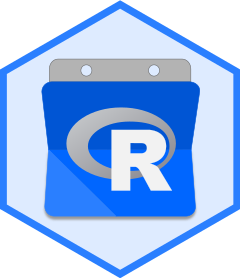

<!-- README.md is generated from README.Rmd. Please edit that file -->

# gcalendr 

<!-- badges: start -->

[](https://travis-ci.org/andrie/gcalendr)
[](https://www.tidyverse.org/lifecycle/#experimental)
[](https://cran.r-project.org/package=gcalendr)
[](https://codecov.io/gh/andrie/gcalendr?branch=master)
<!-- badges: end -->

This package enables you to read events from google calendar.

## Installation

The package is not yet on CRAN.

You can install the development version of `gcalendr` from github using:

``` r
# install.packages("devtools")
devtools::install_github("andrie/gcalendr")
```

## Example

Use this example to authenticate, list available calendars and view
events:

``` r
## Set up google oauth permissions
## This will prompt you to specify an account
calendar_auth()
```

``` r
## To specify a specific account, provide your account id, typically an email address
calendar_auth("apdevries@gmail.com")

## Retrieve tibble of available calenders
calendar_ids <- calendar_list()
calendar_ids

## Retrieve tibble of events from a specific calendar

my_cal_id <- "apdevries@gmail.com"
events <- calendar_events(my_cal_id, days_in_past = 90, days_in_future = 90)
events
```
